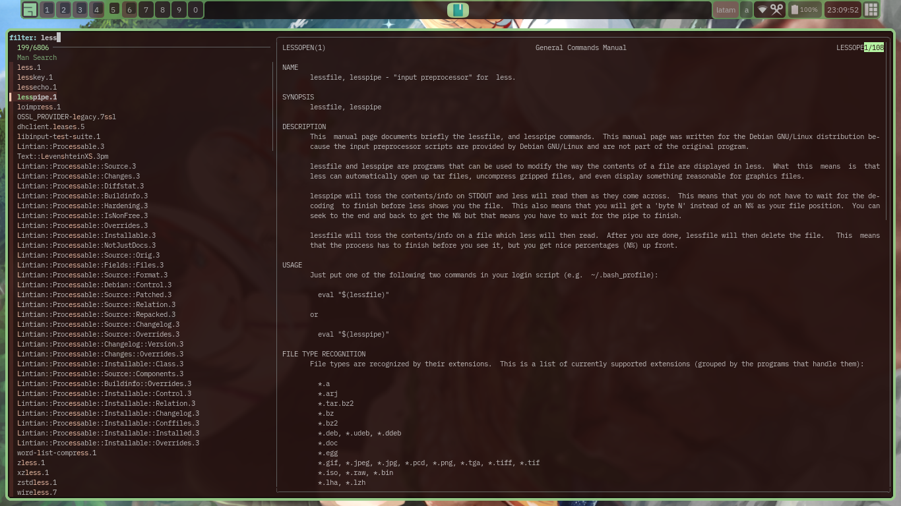

# ManSearch

Man Page search with fzf



## Install

```
git clone https://github.com/eylles/mansearch
cd copypasta
make install
```

The config file is expected to be located in `${XDG_CONFIG_HOME:-${HOME}/.config}/mansearch/configrc`

The script search on all the paths returned by manpath for manpages, if you choose one then it will
be opened with man.
